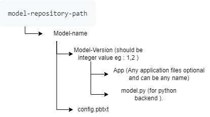

# Serving AI/ML Models Using the Triton Inference Server

## Overview

NVIDIA's Triton Inference Server is designed to serve machine learning (ML) models in a scalable, efficient,
and flexible manner, easing the need to redesign model serving or deployment systems every time models are
deployed. It supports multiple frameworks, including TensorFlow, PyTorch, ONNX, TensorRT, and traditional ML
models from Scikit-Learn, XGBoost and LightGBM . Triton is designed to handle high-performance inference
workloads with features like dynamic batching, concurrent model serving, and advanced monitoring. Triton also
provides HTTP and gRPC endpoints for communication, making it easy to integrate with various client applications.
The Triton Inference Server can be deployed on a single server, in a Docker container, or in a Kubernetes cluster,
offering flexibility in deployment environments. A detailed article on the triton server can be found [here](https://developer.nvidia.com/blog/deploying-ai-deep-learning-models-with-triton-inference-server/).

In this project, a pre-trained ML Model is served using NVIDIA's Triton Inference Server. The model served is the
Question and Answer (QA) Model from Huggingface and is able to retrieve the answer to a question from a given text,
proving useful in searching for answers in a document or file. The project is served within a docker container
allowing for the setup to be hosted on any server/computer.

The setup can be deployed as a solution in a variety of industries such as the legal and healthcare industries.

## Serving Models with the Triton Inference Server

In production, the models to be served should have been trained and tested by Data Scientists and deemed to be ready
for real-world deployments. The trained model is loaded into the server along with its configuration file which
outlines the model’s settings, including inputs, outputs, batch size, and other operational details that Triton
requires to serve the model. The default name of the configuration file is [config.pbtxt](triton/model-repo/tinyroberta/1/config.pbtxt),
and making changes to the model configuration without updating the Triton server configuration will cause the
Triton Inference Server to fail since the model and server configurations do not match.

The model directory structure is such that the parent file is named "model-repo" with several models being hosted
under this directory. Under each model directory in the parent directory, several versions of each model can exist
and can be used for inference, provided the Inference endpoint is directed to the model version.

In this project, the pretrained model is called "tinyroberta" and has just one version loaded into the "model-repo".
Also, each model version has its own configuration and backend which must be specified in its configuration file.
Similar to the configuration, making changes to the model backend without updating the Triton server configuration
will cause the Triton Inference Server to fail since the model backend and server configurations do not match. The
model configuration files have to be written to match the input and output preferences of the chosen backend.

